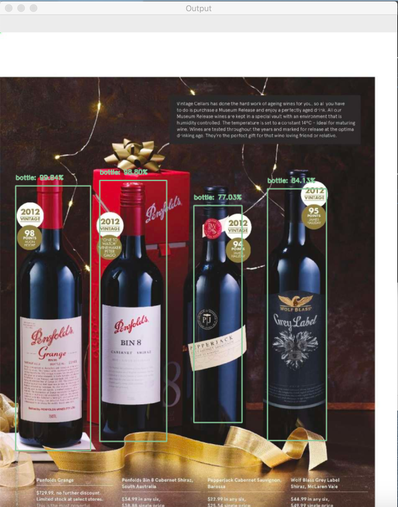
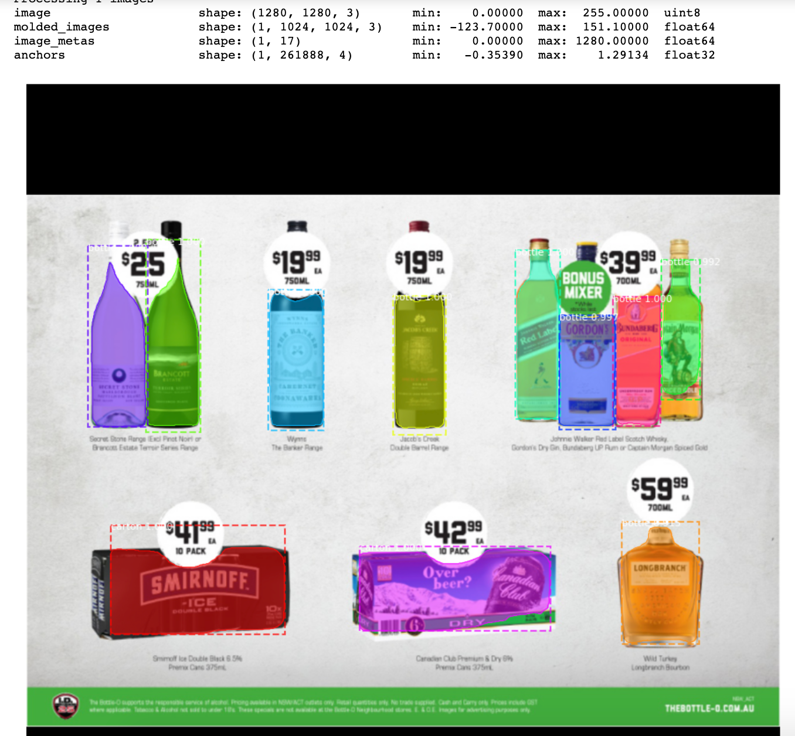

# Alcohol-Catalog-Object-Detection
This page describes how SSD and Mask RCNN works for object detection in alcohol catalog situation.

## Approach
To build a multi-object CBIR, object detection and object recoginition are needed. Given a catalog of alcohol from retailers, I want to detect every bottle/can/carton/label from it.

Since the shape of bottle/can/carton/label is quite unique, this could be very easily by applying a sliding window and train a classical HOG+SVM binary classfier, but with a super slow speed.

Modern deep learning-based models can work very well. SSD neural networks can output a set of bounding boxes and classes achieving detection by only fed each pixel of the input image only once to the model. The result below is using SSD framework combined with MobileNet architecture.The bounding boxes are not accurate though.

Mask RCNN is more interesting because it gives a pixel-level masking, which might be more helpful for object recognition step. I trained on my own dataset labeled using VGG Image Annotator. The results is quite good, especially it learned to avoid the pricing tags.

Notebooks for:
1. Inspect labeled data
2. Inspect models
3. Test the result
have been added as well.

